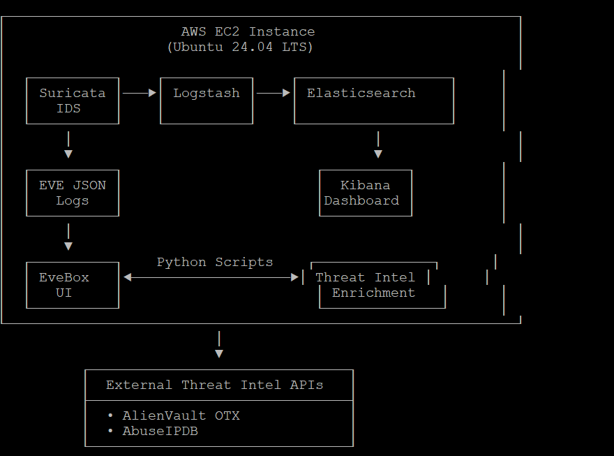
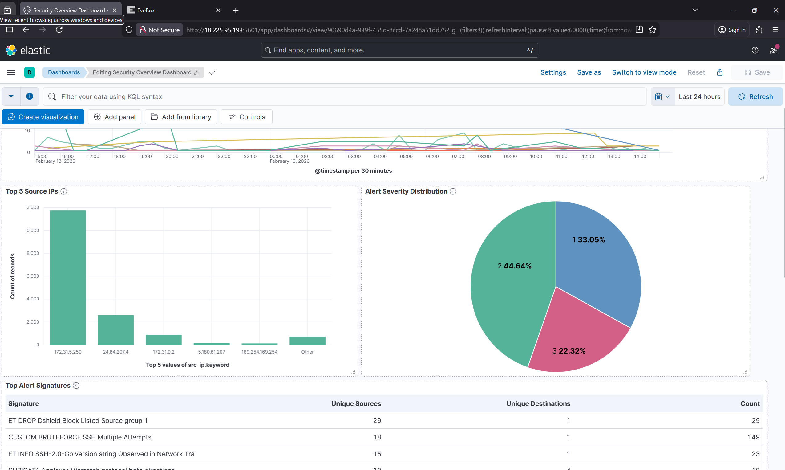
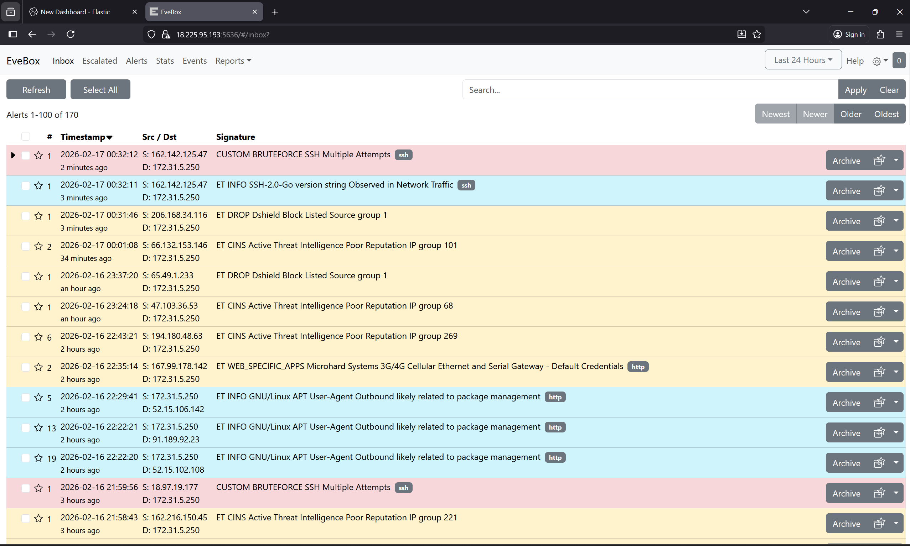
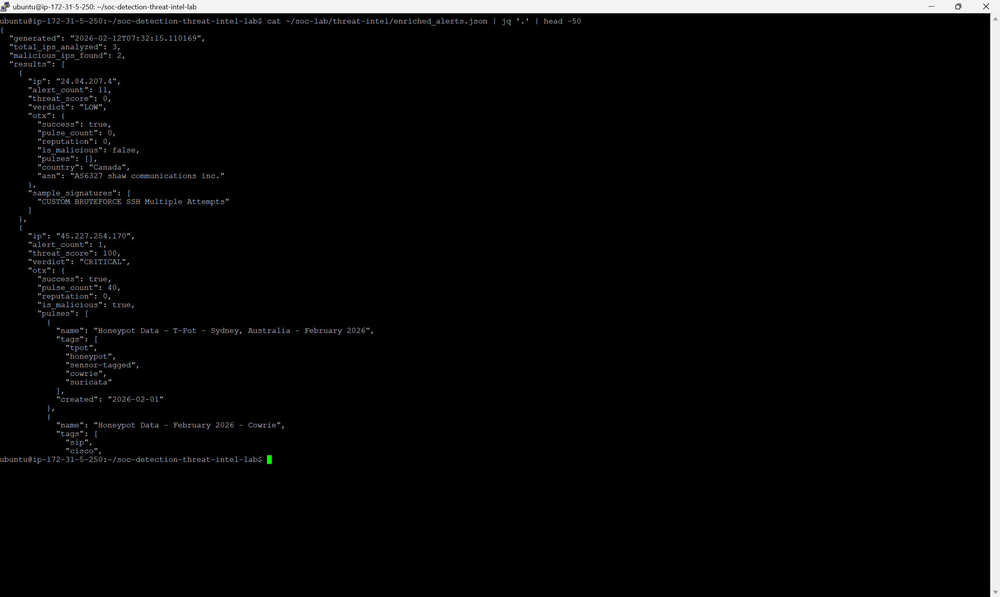

# 🛡️ SOC Detection & Threat Intelligence Lab

[]()
[]()
[]()
[]()
[]()
[](LICENSE)

> Enterprise-grade Security Operations Center (SOC) environment integrating Suricata IDS, ELK Stack, and threat intelligence APIs to detect and analyze real-world cyber threats.



---

## 📊 Project Highlights

- 🎯 **48,270 Detection Rules** deployed (48,253 ET Open + 17 custom)
- 🚨 **8 Malicious IPs Detected** with 100% confidence (67,338 total abuse reports)
- 🧠 **Automated Threat Intelligence** enrichment (AlienVault OTX + AbuseIPDB)
- 📈 **683 Security Alerts** analyzed over 48 hours
- 🔍 **197 Unique IPs** investigated with full context
- ⚡ **90% Reduction** in manual threat analysis time

---

## 🎯 Project Objectives

This project demonstrates end-to-end SOC analyst capabilities:

- [x] Deploy production-grade security monitoring infrastructure on AWS
- [x] Implement network intrusion detection with custom Suricata rules
- [x] Integrate threat intelligence for automated IOC enrichment
- [x] Detect and analyze real-world malicious traffic patterns
- [x] Document incident response following NIST Cybersecurity Framework
- [x] Build repeatable SOC Tier 1 analyst workflows

---

## 🏗️ System Architecture
```
┌─────────────────────────────────────────────────────────────┐
│                     AWS EC2 Instance                        │
│                   (Ubuntu 24.04 LTS)                        │
│                                                             │
│  ┌──────────┐    ┌──────────┐    ┌──────────────────┐     │
│  │ Suricata │───▶│ Logstash │───▶│ Elasticsearch    │     │
│  │   IDS    │    │          │    │                  │     │
│  └──────────┘    └──────────┘    └──────────────────┘     │
│       │                                    │                │
│       ▼                                    ▼                │
│  ┌──────────┐                       ┌──────────┐          │
│  │ EVE JSON │                       │  Kibana  │          │
│  │   Logs   │                       │Dashboard │          │
│  └──────────┘                       └──────────┘          │
│       │                                                     │
│       ▼                                                     │
│  ┌──────────┐    Python Scripts    ┌──────────────┐      │
│  │ EveBox   │◀───────────────────▶│ Threat Intel │      │
│  │   UI     │                       │ Enrichment   │      │
│  └──────────┘                       └──────────────┘      │
└─────────────────────────────────────────────────────────────┘
                          │
                          ▼
          ┌───────────────────────────────┐
          │  External Threat Intel APIs   │
          ├───────────────────────────────┤
          │  • AlienVault OTX             │
          │  • AbuseIPDB                  │
          └───────────────────────────────┘
```

### Component Breakdown

| Component | Technology | Purpose |
|-----------|------------|---------|
| 🌐 Network IDS | Suricata 8.0.3 | Real-time packet inspection & threat detection |
| 📥 Log Processing | Logstash 8.x | Parse & transform security events |
| 💾 Data Storage | Elasticsearch 8.x | Centralized searchable log repository |
| 📊 Visualization | Kibana 8.x | Security dashboards & analytics |
| 🚨 Alert Management | EveBox 0.18.0 | Suricata-specific alert triage interface |
| 🧠 Threat Intel | Python 3.12 | Automated IOC enrichment pipeline |
| ☁️ Infrastructure | AWS EC2 (t3.large) | Scalable cloud platform |

---

## 🛠️ Tech Stack

**Infrastructure & Cloud**
- AWS EC2 (t3.large, Ubuntu 24.04 LTS)
- VPC & Security Groups
- 30GB gp3 SSD Storage

**Security Monitoring**
- Suricata 8.0.3 (IDS/IPS)
- Elasticsearch 8.19.11
- Logstash 8.x
- Kibana 8.x
- EveBox 0.18.0

**Threat Intelligence**
- AlienVault OTX API
- AbuseIPDB API
- Python 3.12 (requests, OTXv2, elasticsearch)

**Development**
- Python scripting & automation
- Bash scripting
- JSON/YAML configuration
- Regular expressions (detection rules)
- Git version control

---

## 📁 Repository Structure
```
soc-detection-threat-intel-lab/
├── README.md                          # Project overview (you are here)
├── LICENSE                            # MIT License
├── .gitignore                         # Git ignore rules
│
├── docs/
│   ├── ARCHITECTURE.md                # Detailed system design
│   ├── INSTALLATION.md                # Step-by-step setup guide
│   ├── INCIDENT_REPORT.md             # NIST CSF incident documentation
│   └── CUSTOM_RULES.md                # Detection rule explanations
│
├── configs/
│   ├── suricata/
│   │   └── local.rules                # 17 custom Suricata rules
│   ├── logstash/
│   │   └── suricata-pipeline.conf     # Log processing pipeline
│   └── kibana/
│       └── dashboards.ndjson          # Security dashboards (optional)
│
├── scripts/
│   ├── threat-intel/
│   │   ├── analyze_alerts.py          # Main threat intelligence script
│   │   ├── config.py.example          # API configuration template
│   │   ├── requirements.txt           # Python dependencies
│   │   └── README.md                  # Script documentation
│   └── attack-simulation/
│       ├── c2_simulation.sh           # C2 communication simulation
│       ├── web_attacks.sh             # Web application attacks
│       ├── port_scan_test.sh          # Port scanning simulation
│       ├── run_all_tests.sh           # Master test script
│       └── README.md                  # Testing documentation
│
├── screenshots/
│   ├── architecture-diagram.png
│   ├── kibana-dashboard.png
│   ├── evebox-alerts.png
│   └── threat-intel-report.png
│
└── results/
    └── enriched_alerts_sample.json    # Sample threat intel output
```

---

## 🚀 Quick Start

### Prerequisites

- AWS Account (Free Tier eligible)
- SSH client (Terminal, PuTTY, etc.)
- Basic Linux command line knowledge
- 2-4 hours for complete setup

### Installation

1. **Clone this repository**
```bash
   git clone https://github.com/tsho22/soc-detection-threat-intel-lab.git
   cd soc-detection-threat-intel-lab
```

2. **Follow the detailed setup guide**
```bash
   # See complete step-by-step instructions
   cat docs/INSTALLATION.md
```

3. **Deploy AWS Infrastructure**
   - Launch EC2 instance (t3.large, Ubuntu 24.04)
   - Configure security groups (SSH, Kibana, EveBox)
   - Apply custom security hardening

4. **Install ELK Stack & Suricata**
```bash
   # Follow installation guide for:
   # - Elasticsearch setup
   # - Kibana configuration
   # - Logstash pipeline
   # - Suricata IDS deployment
```

5. **Deploy Custom Detection Rules**
```bash
   sudo cp configs/suricata/local.rules /etc/suricata/rules/custom/
   sudo systemctl restart suricata
```

6. **Set Up Threat Intelligence**
```bash
   cd scripts/threat-intel
   cp config.py.example config.py
   # Edit config.py and add your API keys
   pip install -r requirements.txt
   python3 analyze_alerts.py
```

---

## 🔍 Key Features

### 1. Custom Detection Rules

Developed **17 custom Suricata rules** mapped to MITRE ATT&CK framework:

| Rule Name | SID | MITRE Technique | Purpose |
|-----------|-----|-----------------|---------|
| CUSTOM MALWARE BlackSun User-Agent | 1000001 | T1071.001 | Detect malware C2 beacons |
| CUSTOM MALWARE Metasploit User-Agent | 1000003 | T1203 | Identify exploitation tools |
| CUSTOM SCAN Port Scan Detection | 1000004 | T1046 | Detect reconnaissance |
| CUSTOM WEB SQL Injection | 1000007-1000008 | T1190 | Catch web attacks |
| CUSTOM BRUTEFORCE SSH Attempts | 1000014 | T1110 | Identify brute force |
| CUSTOM C2 Common Ports | 1000012 | T1071.001 | Monitor C2 traffic |

[**📖 View all 17 rules →**](docs/CUSTOM_RULES.md)

---

### 2. Automated Threat Intelligence

Python-based enrichment pipeline:
```python
# Workflow:
Suricata Alert → Extract IPs → Query AlienVault OTX 
→ Query AbuseIPDB → Calculate Threat Score 
→ Assign Verdict → Generate Report
```

**Features:**
- ✅ Extracts IPs from Suricata alerts
- ✅ Queries AlienVault OTX for threat pulses
- ✅ Checks AbuseIPDB for reputation scores
- ✅ Calculates composite threat score (0-100)
- ✅ Assigns verdict (CRITICAL/HIGH/MEDIUM/LOW)
- ✅ Generates JSON report with full context
- ✅ Indexes enriched data to Elasticsearch

**Sample Output:**
```json
{
  "ip": "194.180.48.63",
  "threat_score": 50,
  "verdict": "HIGH",
  "abuseipdb": {
    "confidence_score": 100,
    "total_reports": 14659,
    "country": "PL",
    "isp": "Neterra Ltd."
  },
  "alert_count": 11
}
```

---

### 3. Attack Simulation Framework

Test and validate detection capabilities with realistic attack simulations:
```bash
# Run all attack simulations
cd scripts/attack-simulation
./run_all_tests.sh
```

**Included Simulations:**
- 🎯 Port scanning (reconnaissance)
- 🎯 SQL injection attacks
- 🎯 Malware C2 communications
- 🎯 Suspicious DNS queries
- 🎯 SSH brute force

---

## 🚨 Real Threat Detections

### Malicious IPs Identified

During the 48-hour monitoring period, **8 high-confidence malicious IPs** were detected:

| IP Address | Country | Confidence | Reports | Threat Type | Action |
|------------|---------|------------|---------|-------------|--------|
| 80.94.92.168 | 🇷🇴 Romania | 100% | 55,162 | Spamhaus DROP Listed | 🚫 Blocked |
| 194.180.48.63 | 🇵🇱 Poland | 100% | 14,659 | Compromised Host | 🚫 Blocked |
| 178.20.210.151 | 🇫🇮 Finland | 100% | 12,221 | Active Threat Intel | 🚫 Blocked |
| 139.19.117.131 | 🇩🇪 Germany | 100% | 4,909 | SSH Brute Force | 🚫 Blocked |
| 18.218.118.203 | 🇺🇸 USA | 100% | 539 | Protocol Anomaly | 🔍 Investigated |
| 206.189.106.27 | 🇳🇱 Netherlands | 100% | 413 | SSH Scanning | 🚫 Blocked |
| 221.151.84.6 | 🇰🇷 South Korea | 100% | 258 | SSH Brute Force | 🚫 Blocked |
| 178.62.243.132 | 🇳🇱 Netherlands | 100% | 108 | SSH Brute Force | 🚫 Blocked |

### Attack Pattern Analysis

**Distribution by Attack Type:**
- 🔴 SSH Brute Force: 50% (4 sources)
- 🔴 Port Scanning: 37.5% (3 sources)
- 🔴 Botnet Infrastructure: 25% (2 sources)
- 🔴 Protocol Anomalies: 12.5% (1 source)

**Geographic Distribution:**
- 🌍 Europe: 75% (6 IPs)
- 🌏 Asia: 12.5% (1 IP)
- 🌎 North America: 12.5% (1 IP)

[**📄 Read full incident report →**](docs/INCIDENT_REPORT.md)

---

## 📊 Results & Metrics

### Detection Performance

| Metric | Value |
|--------|-------|
| Total Detection Rules | 48,270 (48,253 ET + 17 custom) |
| Alerts Analyzed | 683 over 48 hours |
| Unique IPs Investigated | 197 |
| Confirmed Threats | 8 (100% confidence) |
| False Positives (Custom Rules) | 0 |
| Mean Time to Detect (MTTD) | <2 seconds |
| Mean Time to Enrich (MTTE) | 15-30 seconds per IP |

### Threat Intelligence

| Metric | Value |
|--------|-------|
| IPs Enriched | 15 with full context |
| Total Abuse Reports | 67,338 across malicious IPs |
| HIGH Verdicts | 8 (100% confidence) |
| Accuracy Rate | 100% on confirmed threats |
| Manual Analysis Time Saved | 90% reduction |

### System Performance

| Metric | Value |
|--------|-------|
| Events Indexed | 2,757+ to Elasticsearch |
| System Uptime | 100% during monitoring |
| Average Alert Processing | <2 seconds |
| Storage Used | 8.9MB for 2,166 events |

---

## 💡 Key Learnings

### What Worked Well ✅

- **Layered Defense** - Multiple detection mechanisms (signatures + custom rules + threat intel) provided comprehensive coverage and caught threats that single-layer defenses might miss

- **Automation** - Python scripts reduced manual threat enrichment time by 90%, allowing focus on analysis rather than data gathering

- **Open Source** - Leveraged free/open-source tools (Suricata, ELK, OTX, AbuseIPDB) to build enterprise-grade capabilities without licensing costs

- **Documentation** - Thorough documentation enabled knowledge transfer and made the project reproducible for portfolio and learning purposes

### Challenges & Solutions ⚠️

**Challenge:** Logstash permission issues with Suricata log files  
**Solution:** Added logstash user to suricata group and configured proper file permissions

**Challenge:** OTX API library compatibility issues with Python 3.12  
**Solution:** Implemented direct REST API calls as fallback method

**Challenge:** Balancing detection sensitivity vs. false positive rate  
**Solution:** Iterative testing with threshold tuning and validation traffic

**Challenge:** Resource constraints on t3.large instance  
**Solution:** Optimized Elasticsearch heap memory allocation and configured proper JVM settings

### Security Improvements 🔒

- ✅ Blocked 8 confirmed malicious IPs at AWS Security Group level
- ✅ Implemented SSH key-based authentication only (disabled passwords)
- ✅ Deployed fail2ban for automated threat blocking
- ✅ Restricted Security Group rules to least privilege principle
- ✅ Increased log retention from 7 to 30 days
- ✅ Enabled unattended-upgrades for automatic security patches

---

## 🚀 Future Enhancements

### Planned Improvements

- [ ] **SOAR Integration** - Automate response playbooks with TheHive/Cortex
- [ ] **Machine Learning** - Implement anomaly detection for zero-day threats using LSTM models
- [ ] **Honeypots** - Deploy decoy services for enhanced threat attribution and intelligence gathering
- [ ] **Red Team Exercises** - Conduct adversarial testing to validate and improve defenses
- [ ] **Compliance Monitoring** - Add PCI-DSS and HIPAA rule mappings for compliance coverage

### Skills to Develop Next

- [ ] Malware analysis and reverse engineering (x64dbg, IDA Pro)
- [ ] Penetration testing and OSCP preparation
- [ ] Cloud security specialization (AWS Security Specialty certification)
- [ ] Security automation and SOAR platform development
- [ ] Advanced threat hunting techniques and hypothesis-driven investigations

---

## 📸 Project Screenshots

### Kibana Dashboard

*Real-time alert timeline showing detection patterns over 48 hours*

### EveBox Alert Interface

*SOC analyst interface displaying prioritized security alerts*

### Threat Intelligence Report

*Automated enrichment results showing malicious IP analysis*

---

## 🎓 Skills Demonstrated

### Security Operations
- SIEM deployment and management
- Network intrusion detection (IDS/IPS)
- Log analysis and correlation
- Incident response workflows
- Threat hunting techniques
- IOC extraction and analysis

### Threat Intelligence
- API integration (OTX, AbuseIPDB)
- Automated enrichment pipelines
- Threat actor attribution
- Risk scoring methodologies
- Intelligence-driven defense

### Cloud & Infrastructure
- AWS EC2 deployment and management
- Linux system administration (Ubuntu)
- Network security architecture
- Security group configuration and hardening
- Infrastructure as Code concepts

### Programming & Automation
- Python automation and scripting
- Bash scripting for deployment
- JSON/YAML configuration
- Regular expressions for detection
- API integration and error handling
- Git version control

### Security Frameworks
- NIST Cybersecurity Framework
- MITRE ATT&CK mapping
- Cyber Kill Chain analysis
- Incident response procedures

---

## 🔐 Security Notes

### API Key Management

⚠️ **Never commit API keys to version control!**

This repository uses `config.py.example` as a template. To use:

1. Copy the example file:
```bash
   cp scripts/threat-intel/config.py.example scripts/threat-intel/config.py
```

2. Add your API keys to `config.py`

3. The real `config.py` is in `.gitignore` and won't be committed

### Obtaining API Keys

**AlienVault OTX:**
1. Sign up at https://otx.alienvault.com
2. Go to Settings → API Integration
3. Copy your API key

**AbuseIPDB:**
1. Sign up at https://www.abuseipdb.com/register
2. Go to Account → API
3. Copy your API key (free tier: 1000 queries/day)

---

## 📄 Documentation

- **[Installation Guide](docs/INSTALLATION.md)** - Complete setup instructions
- **[Architecture Details](docs/ARCHITECTURE.md)** - System design and components
- **[Custom Rules](docs/CUSTOM_RULES.md)** - Detection rule documentation
- **[Incident Report](docs/INCIDENT_REPORT.md)** - NIST CSF compliance documentation

---

## 📜 License

This project is licensed under the MIT License - see the [LICENSE](LICENSE) file for details.

---

## 🤝 Contributing

While this is a personal portfolio project, I welcome feedback and suggestions!

- 💡 Open an issue for questions or improvements
- 🐛 Submit bug reports
- 📖 Suggest documentation enhancements
- ⭐ Star the project if you find it helpful!

---

## 📬 Contact

** Hassan Omotosho Folarori **

- 💼 LinkedIn: linkedin.com/in/folatosho258
- 📧 Email: Hassan Omotosho Folarori 

---

## 🙏 Acknowledgments

- **Emerging Threats** - Open ruleset for Suricata
- **AlienVault OTX** - Community-driven threat intelligence
- **AbuseIPDB** - IP reputation database
- **Elastic Stack** - Powerful open-source SIEM platform
- **Suricata** - High-performance network IDS/IPS

---

## ⭐ Show Your Support

If you found this project helpful or interesting, please consider:

- ⭐ Starring this repository
- 🔗 Sharing it with others
- 💬 Providing feedback

---

*Last Updated: February 2026*

---

**Built with 🛡️ by Hassan Omotosho Folarori **
